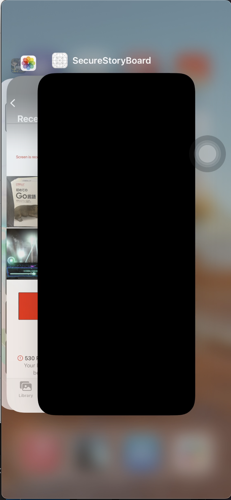

## isSecureTextEntry を使う

iOS では [userDidTakeScreenshotNotification](https://developer.apple.com/documentation/uikit/uiapplication/1622966-userdidtakescreenshotnotificatio) や [capturedDidChangeNotification](https://developer.apple.com/documentation/uikit/uiscreen/2921652-captureddidchangenotification) を使うと、ユーザーがスクショや画面録画の開始イベントを監視することが可能です。

しかし、通知タイミングが**イベント完了**であることが致命的に響いてきます。  
[録画についてはなんとかなる](https://qiita.com/osyou84/items/83800faa1a8e678ff600)のですが、スクショにおいては完全にイベントが完了しており、画像フォルダに画像が格納された後となります。

これは期待値ではないため、次のように `UITextField#isSecureTextEntry` を用いて実装します。

### [UITextField#isSecureTextEntry](https://developer.apple.com/documentation/uikit/uitextinputtraits/1624427-issecuretextentry)

iOS においては、[UITextField#isSecureTextEntry](https://developer.apple.com/documentation/uikit/uitextinputtraits/1624427-issecuretextentry) の値を true にすることで、テキストを隠したりレコード・ブロードキャストから守る事が可能になります。

> A Boolean value that indicates whether a text object disables copying,
> and in some cases, prevents recording/broadcasting and also hides the text.

### subView として UITextField を加える

実は、`UITextField#isSecureTextEntry` を活用することで、**全体の**スクリーンショットを防止する事が可能です。  
（sublayer を他に持っていない時）

Secure な TextField を sublayer として下敷きにしておくことで、うまくやっているものと思われます。  
（難しい。。。）

```swift
class ViewController: UIViewController {
    ...

    override func viewDidLoad() {
        super.viewDidLoad()

        testView.makeSecure()
    }
}

extension UIView {
    func makeSecure() {
        DispatchQueue.main.async {
            let bgView = UIView(frame: UIScreen.main.bounds)
            bgView.backgroundColor = .black
            self.superview?.insertSubview(bgView, at: 0)

            let field = UITextField()
            field.isSecureTextEntry = true
            self.addSubview(field)

            field.centerYAnchor.constraint(equalTo: self.centerYAnchor).isActive = true
            field.centerXAnchor.constraint(equalTo: self.centerXAnchor).isActive = true
            self.layer.superlayer?.addSublayer(field.layer)
            field.layer.sublayers?.first?.addSublayer(self.layer)
        }
    }
}
```

また、iOS ではこちらの手法を使うことで、特定要素にのみフィルタをかけることが可能かと思われます。

### 実動

こちらは QuickTime Player を使って対象のアプリを mac で投影した時です。  
（[iphone の画面を mac 上に表示する方法](https://koko206.hatenablog.com/entry/2022/03/13/204133)）

（おそらく）ブロードキャストモードと判断されているため、画面が無事真っ黒になっています。



### SwiftUI

上記では StoryBoard なるものを使いましたが、最近は SwiftUI を使います。

そこで SwiftUI でもやってみようとしたのですが、自分の Swift, SwiftUI 力が足りず、実装できませんでした。  
できる方は教えてください！！

### Links

- [Prevent screen capture in an iOS app](https://stackoverflow.com/questions/18680028/prevent-screen-capture-in-an-ios-app)
- [[iOS, Swift] Prevent ScreenShot](https://tigi44.github.io/ios/iOS,-Swift-Prevent-Screen-Capture/)
