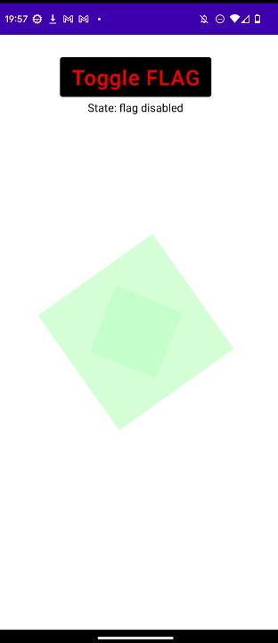

## [SECURE_FLAG](https://developer.android.com/reference/android/view/WindowManager.LayoutParams#FLAG_SECURE)

Android で画面録画を禁止するには、[WindowManager.LayoutParams#SECURE_FLAG](https://developer.android.com/reference/android/view/WindowManager.LayoutParams#FLAG_SECURE) を設定してあげるのが最も簡単で正確です。

### フラグ操作方法

window に対して設定するには、[window#setFlags](<https://developer.android.com/reference/android/view/Window#setFlags(int,%20int)>) を使って設定してあげます。

```kotlin
window.setFlags(
    WindowManager.LayoutParams.FLAG_SECURE,
    WindowManager.LayoutParams.FLAG_SECURE,
)
```

フラグを削除するには、[window#clearFlags](<https://developer.android.com/reference/android/view/Window#clearFlags(int)>) を呼びます。

```kotlin
window.clearFlags(WindowManager.LayoutParams.FLAG_SECURE)
```

clearFlag**s** の引数が 1 つであることから想像もできるように、各々のフラグはビット単位で `2**n` だけ異なっているため、各フラグの和から、元のフラグが構成できるようになっています。

例えばこんな感じです。

```java
public static final int FLAG_DITHER = 0x00001000;
public static final int FLAG_SECURE = 0x00002000;
public static final int FLAG_SCALED = 0x00004000;
```

そのため、現在 window に**特定のフラグ**が指定されているかを確認するには、以下のようにします。

```kotlin
fun hasSecureFlag(): Boolean {
    // 今回チェックしたいフラグ: Int 型。
    val FLAG = WindowManager.LayoutParams.FLAG_SECURE
    // 現在設定されているフラグの和: Int 型。
    val flags = window.attributes.flags

    // 論理和を取り、該当ビットが0かどうか判断する。
    return flags and FLAG != 0
}
```

### 動作確認

SECURE_FLAG を設定すると、スクリーンショット時とスクリーンレコード時に画面が真っ黒になります。  
[scrcpy](https://github.com/Genymobile/scrcpy) 等で画面を他端末に投影した場合も同様です。

なぜか録画を開始すると、スクリーンショット（電源ボタン + 音量下）がうまく撮れない。



### Links

- [FLAG_SECURE official](https://developer.android.com/reference/android/view/WindowManager.LayoutParams#FLAG_SECURE)
- [FLAG_SECURE に対するポリシー](https://support.google.com/googleplay/android-developer/answer/12253906#flag_secure_preview)
- [prevent screen capture in Android apps (stack overflow)](https://stackoverflow.com/questions/6764568/prevent-screen-capture-in-android-apps)
